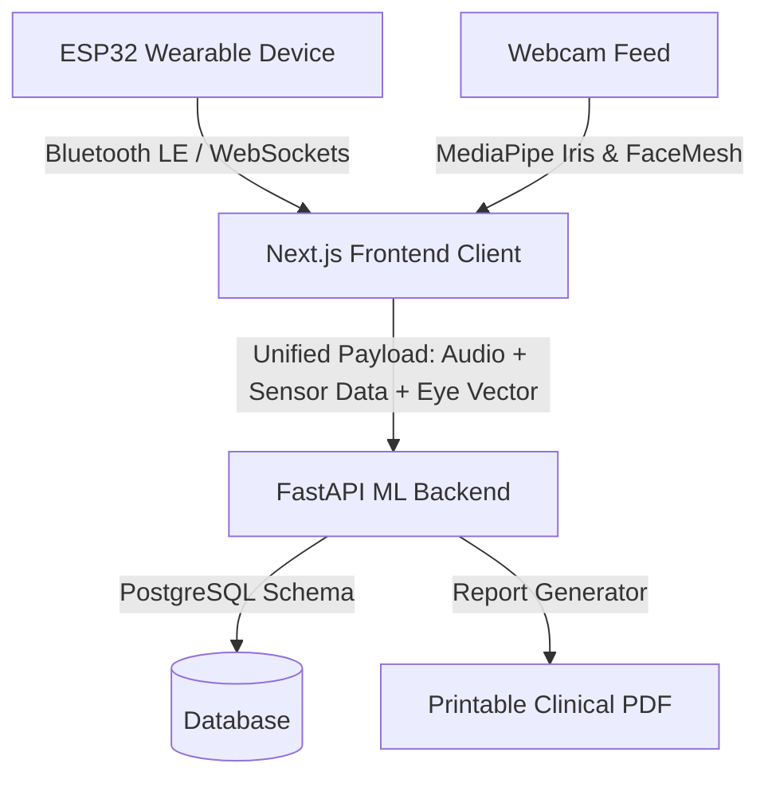

# MindTone IoT & Biomedical Hardware Architecture Guide

This guide details the implementation of an IoT and biomedical hardware integration for MindTone. It provides a blueprint for a clinical-grade screening device within a **₹20,000 INR** budget, structured in collaboration with clinical consultations.

---

## 1. Core Hardware Strategy: Desktop vs. Sensor Suite

To maximize the ₹20,000 budget, we divide the data acquisition into two channels:
1.  **Software-Based Biometrics (Webcam):** Facial expressions and iris movement (eye-tracking) do not require expensive dedicated hardware. Standard webcams paired with high-performance browser libraries (MediaPipe and WebGazer.js) perform clinical-grade feature tracking.
2.  **Hardware-Based Bio-Sensors (IoT Device):** Physical sensors record physiological responses (ECG, Heart Rate Variability, Galvanic Skin Response, and Blood Pressure) that cannot be captured via webcams.

---

## 2. Bill of Materials (BOM) & Pricing (India)

All prices are researched based on standard Indian electronics retailers (Robu.in, Tanotis, and local distributors).

### Option A: The "Patient Companion" Sensor Suite (₹9,200 total)
This device connects to the patient's laptop/PC via Bluetooth/Wi-Fi and acts as an auxiliary biometric reader.

| Component | Purpose | Est. Price (INR) |
| :--- | :--- | :--- |
| **ESP32-WROOM-32D Development Board** | Microcontroller with built-in Wi-Fi & Dual-mode Bluetooth (BLE) to transmit sensor data to Next.js. | ₹350 |
| **MAX30102 Pulse Oximeter & Heart Rate** | Photoplethysmogram (PPG) sensor for real-time heart rate and SpO2 tracking. | ₹300 |
| **AD8232 ECG Sensor Module** | For Electrocardiogram tracking. Critical for capturing Heart Rate Variability (HRV). Includes leads and gel electrodes. | ₹650 |
| **Grove GSR (Galvanic Skin Response) Sensor** | Measures skin conductance. Crucial for detecting anxiety, sweat spikes, and psychological stress. | ₹1,100 |
| **OEM Automatic BP Cuff Module** | Integrated inflatable cuff, 5V micro-air pump, solenoid release valve, and MPS20N0040D pressure sensor. | ₹2,500 |
| **SSD1306 1.3" OLED Display** | Local screen to show instructions to the patient ("Keep still," "Deep breath," BP reading). | ₹300 |
| **Power System (Battery & Charging)** | 2x 18650 Li-ion cells (₹400) + TP4056 charging module with protection (₹100) + 5V step-up booster (₹200) + slide switches/wires. | ₹800 |
| **Enclosure & Connectors** | Custom 3D-printed desktop casing, electrode jacks, and internal wiring. | ₹1,000 |
| **Logitech C310 HD Webcam** | For high-resolution iris tracking and facial expression capture. | ₹2,200 |
| **TOTAL** | **Estimated Prototype Cost** | **₹9,200** |

---

### Option B: Standalone "Screening Kiosk" Tier (₹16,700 total)
If you want a dedicated device that does not require a patient's laptop (e.g., for doctors to keep on their clinic desk).

*   **Option A Sensor Suite:** ₹7,000 (excluding webcam)
*   **Raspberry Pi 4 (4GB RAM) or Raspberry Pi 5:** ₹6,500 (acts as the local compute engine to run the browser dashboard locally).
*   **Official 7" Raspberry Pi Touch Display:** ₹2,500 (integrated interface for patient inputs).
*   **5MP Raspberry Pi Camera Module V2:** ₹700 (for face/eye tracking).
*   **TOTAL:** **₹16,700**

---

## 3. Medical Justification: What Doctors Care About

To make the system "industry-standard," the sensors must track variables directly mapped to clinical diagnostics:

### 1. Heart Rate Variability (HRV) — via AD8232 ECG
*   **Medical Fact:** Doctors do not just care about heart rate; they care about the *time difference between individual heartbeats* (R-R intervals). 
*   **Clinical Significance:** High HRV indicates a healthy, resilient nervous system. Low HRV is a major clinical marker for **major depressive disorder (MDD), generalized anxiety, and chronic stress**.
*   **Actionable Data:** The AD8232 feeds raw analog ECG data to the ESP32, which calculates the Root Mean Square of Successive Differences (RMSSD) and sends it to the backend.

### 2. Galvanic Skin Response (GSR) / Skin Conductance
*   **Medical Fact:** The sympathetic nervous system controls sweat gland activity. Stress triggers micro-sweating on the fingertips.
*   **Clinical Significance:** GSR is the core technology behind polygraphs. It provides real-time tracking of **emotional arousal and panic spikes** during patient check-in questionnaires.

### 3. Blood Pressure (BP)
*   **Medical Fact:** Chronic anxiety and stress disorders often present physical cardiovascular symptoms, such as elevated systolic blood pressure.
*   **Clinical Significance:** Combining high BP with low HRV and high skin conductance forms a highly accurate "stress profile" that doctors can use to justify clinical intervention.

---

## 4. Software & Sensor Integration Architecture

To keep the system highly efficient, data streams are unified into the Next.js frontend:

### Eye & Face Tracking Implementation (Webcam)
1.  **Iris/Gaze Tracking (Webgazer.js / MediaPipe Iris):** Tracks saccades (rapid eye movements), blink rates (which drop during high cognitive focus but spike during fatigue/depression), and pupil dilation (linked to autonomic arousal).
2.  **Facial Micro-Expressions (MediaPipe FaceMesh):** Map 468 3D facial landmarks. You can train a lightweight classifier in your FastAPI backend to detect Action Units (AUs) from the Facial Action Coding System (FACS) to identify signs of flat affect (common in schizophrenia and depression) or micro-expressions of anxiety.

---

## 5. Next Steps for Prototyping
1.  **Procure the ESP32 & Sensors:** Order the components listed in the BOM.
2.  **Write the ESP32 Firmware:** Use Arduino IDE or MicroPython to read I2C data from the MAX30102/OLED and Analog data from the AD8232/GSR.
3.  **Bridge to Web:** Establish a Web Serial or BLE connection in Next.js to stream sensor values directly into the browser session.
