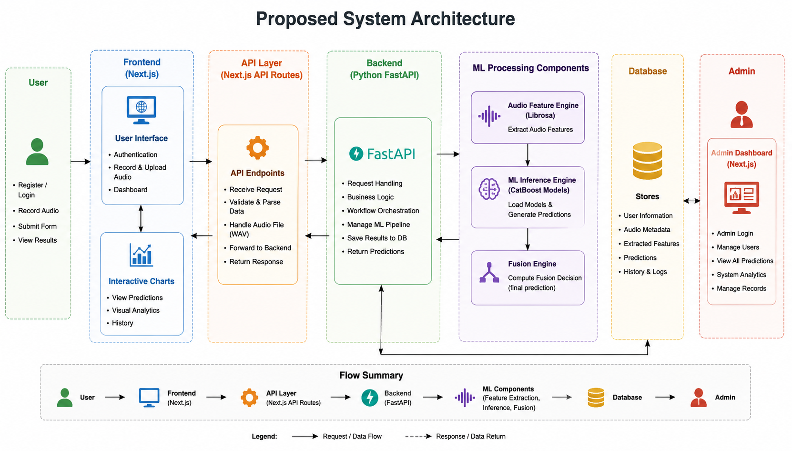
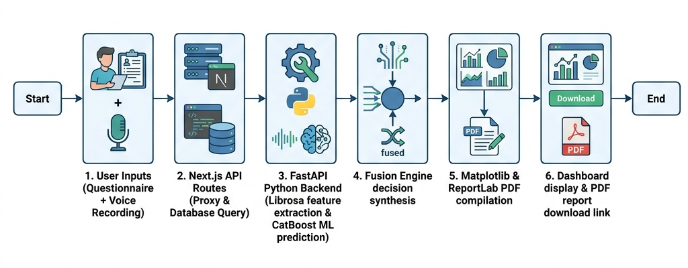
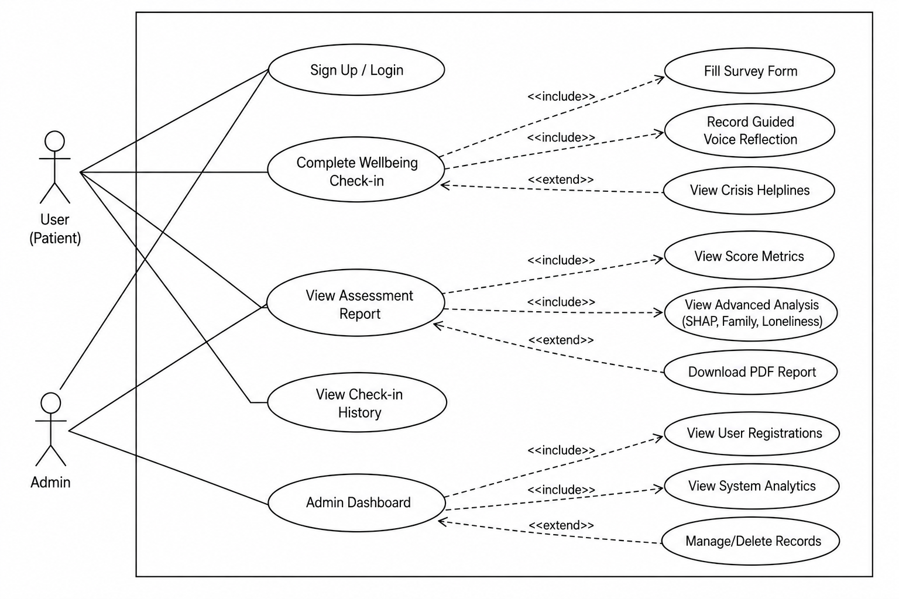
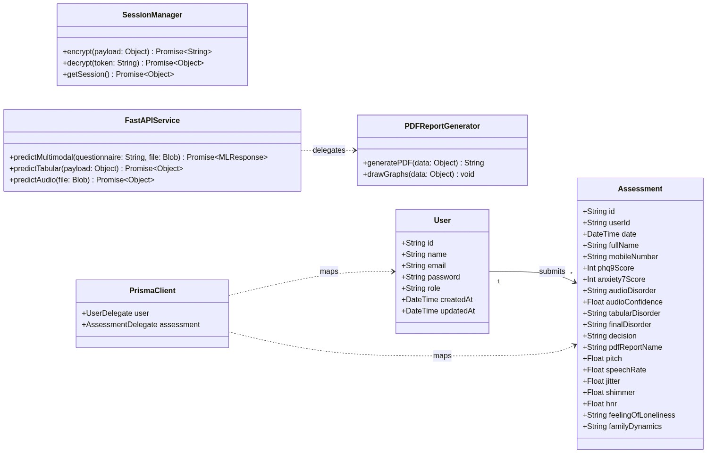
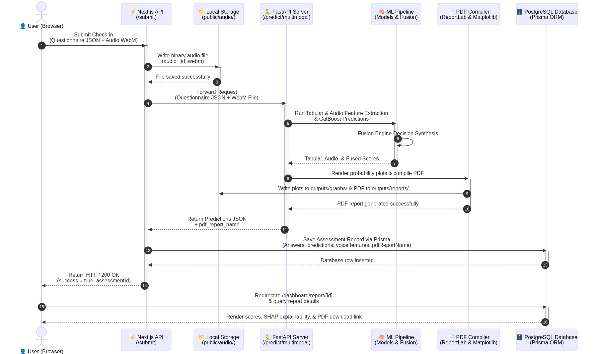
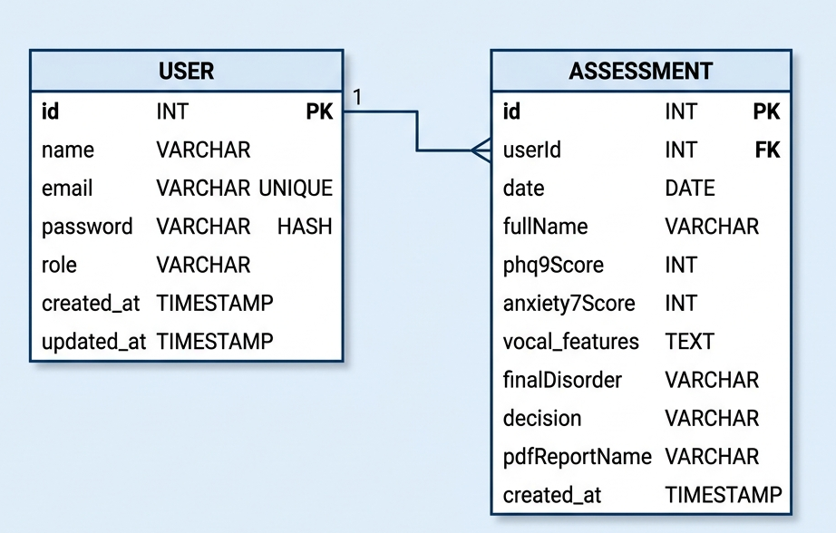
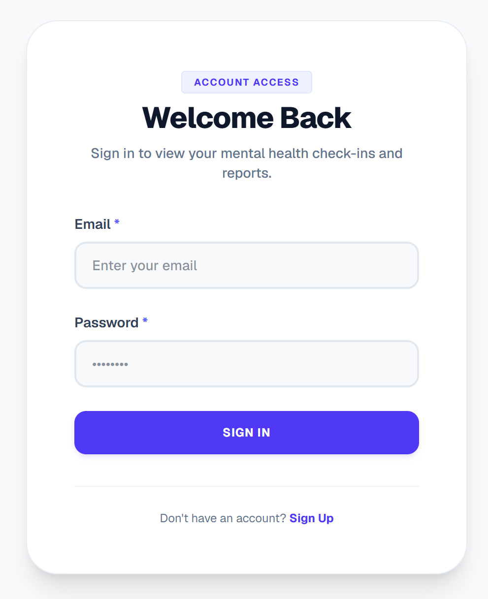
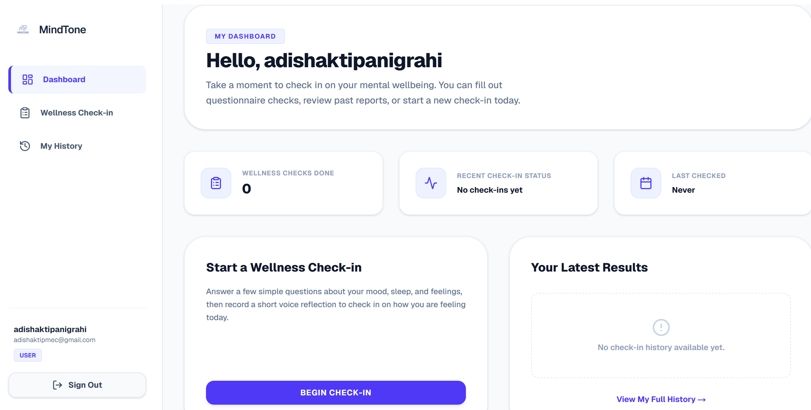
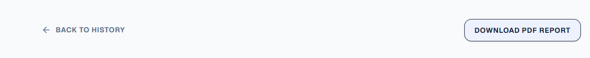
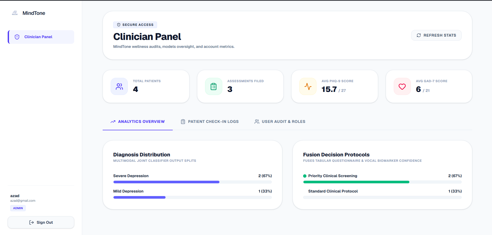

# Chapter 4: Product Design

The system design phase establishes the structural, relational, and conceptual specifications of the MindTone mental health screening platform. This section details the high-level system architecture, data workflows, UML design mappings, relational database schema, and user interface layouts.

---

## 4.1 System Architecture

MindTone utilizes a decoupled, service-oriented architecture designed to handle lightweight frontend requests, complex database mutations, and CPU-intensive machine learning (ML) tasks in isolation.

### Architectural Components:
1. **Frontend User Interface (Next.js):** Runs React client components. It manages secure routes, hosts the microphone recording interface, renders diagnostic charts, and calls the Next.js API serverless layer.
2. **API Proxy Layer:** Built within Next.js API routing. It validates the user's JWT cookie and routes heavy ML payloads directly to the FastAPI microservice while securely communicating with PostgreSQL via Prisma.
3. **FastAPI ML Service (Python):** Handles heavy CPU operations. When a payload arrives, it reads the audio file, extracts acoustic vectors, loads the serialization models (`.pkl` pipelines), and runs inference.
4. **Relational Database (PostgreSQL):** Stores user registration records, history arrays, and feature profiles.

---

## 4.2 Flowchart (System Workflow)

The diagnostic workflow describes the step-by-step processing of a patient assessment, from input to the final printable report:

---

## 4.3 UML Diagrams

### 4.3.1 Use-Case Diagram
The Use-Case diagram details the interactions between the two primary stakeholders—**Patients (Users)** and **Administrators**—and the Mental Health Assessment System boundaries.

* **User (Patient) Interactions:**
  * Sign Up / Log In.
  * Complete Wellbeing Check-in (includes filling the survey form, recording guided voice reflection, and viewing crisis helplines as an extended flow).
  * View Assessment Report (includes viewing score metrics, viewing advanced SHAP/psychosocial analysis, and downloading the PDF report).
  * View Check-in History.
* **Admin Interactions:**
  * Log in to the Admin Dashboard.
  * View System Analytics (total users, average stress levels).
  * View User Registrations.
  * Manage/Delete history records.

---

### 4.3.2 Class Diagram
The Class diagram illustrates the object-oriented structure of the software components, describing attributes, methods, and relationships:

* **Key Classes:**
  * `SessionManager`: Manages session encryption, decryption, and fetching.
  * `FastAPIService`: Coordinates multimodal predictions, tabular predictions, and audio predictions.
  * `PDFReportGenerator`: Manages ReportLab PDF compilation and Matplotlib chart drawing.
  * `PrismaClient`: Connects and delegates database requests.
  * `User`: Stores account credentials and timestamps.
  * `Assessment`: Tracks complete diagnostic and acoustic feature outputs.

---

### 4.3.3 Sequence Diagram
The Sequence diagram tracks the chronological execution flow across components during a multimodal wellbeing check-in:

* **Workflow Timeline:**
  1. Patient submits questionnaire responses and WebM audio recording.
  2. The Next.js API layer stores the raw WebM file.
  3. Next.js passes the request to the FastAPI ML backend.
  4. FastAPI extracts acoustic metrics, executes CatBoost model predictions, and synthesizes the decision in the Fusion Engine.
  5. The report engine plots charts and compiles a PDF report using ReportLab.
  6. Response is sent back to the Next.js frontend to save the database records via Prisma.
  7. User is redirected to the report dashboard where the final scores, SHAP explanations, and PDF download links are displayed.

---

## 4.4 Database Design

The database schema utilizes relational integrity constraints enforced by Prisma and hosted on serverless PostgreSQL (Neon.tech).

### Relational Tables

#### 1. User Table
Tracks registered user credentials, profile information, and roles.

| Column Name | Data Type | Constraints | Description |
| :--- | :--- | :--- | :--- |
| `id` | String | Primary Key, Unique | Unique identifier for each user. |
| `name` | String | Required | Full name of the user. |
| `email` | String | Unique, Required | User email address used for login. |
| `password` | String | Required | Securely hashed password (bcrypt). |
| `role` | String | Default: "USER" | System access level (USER or ADMIN). |
| `createdAt` | DateTime | Default: NOW | Timestamp when account was created. |
| `updatedAt` | DateTime | Auto-update | Timestamp of last profile edit. |

#### 2. Assessment Table
Stores individual screening assessment data, clinical scoring metrics, and voice acoustic outputs.

| Column Name | Data Type | Constraints | Description |
| :--- | :--- | :--- | :--- |
| `id` | String | Primary Key, Unique | Unique identifier for each assessment. |
| `userId` | String | Foreign Key (User) | Maps the assessment to a specific user. |
| `date` | DateTime | Default: NOW | Date and time the check-in occurred. |
| `fullName` | String | Required | Full name provided during assessment. |
| `mobileNumber` | String | Required | Contact number for verification. |
| `phq9Score` | Integer | Required | Total score calculated from PHQ-9 (0-27). |
| `anxietyScore` | Integer | Required | Total score calculated from GAD-7 (0-21). |
| `audioDisorder` | String | Required | Classification output from audio model. |
| `audioConfidence` | Float | Required | Confidence score of the audio classifier. |
| `tabularDisorder` | String | Required | Classification output from tabular model. |
| `finalDisorder` | String | Required | Integrated output from the Fusion Engine. |
| `decision` | String | Required | Clinical action recommendation text. |
| `pdfReportName` | String | Required | Filepath to the generated ReportLab PDF. |
| `pitch` | Float | Required | Extracted fundamental frequency (F0) in Hz. |
| `speechRate` | Float | Required | Words Per Minute (WPM) speed rate. |
| `jitter` | Float | Required | Calculated frequency instability (%). |
| `shimmer` | Float | Required | Calculated amplitude instability (%). |
| `hnr` | Float | Required | Harmonic-to-Noise Ratio (dB). |
| `feelingOfLoneliness`| String | Required | Patient loneliness assessment flag. |
| `familyDynamics` | String | Required | Family dynamic status (Supportive/Dysfunctional). |

---

## 4.5 User Interface (UI) Design

The user interface is designed using an Indigo-brand color system to establish a calm, professional, and accessible clinical environment.

1. **User Authentication (Login Screen):** A centralized Card-style interface containing validated inputs for credentials, featuring micro-interactions on form submission and error indicators.
   
   
   
2. **Patient Dashboard:**
   * **Score Overview Card:** Renders the final fused diagnosis tier and a summary recommendation.
   * **Clinical Feature Panels:** Collapsible panels that expand to reveal detailed acoustic feature metrics (pitch, jitter, shimmer, HNR) mapped against target clinical normal ranges.
   * **Psychosocial Stress Index:** Interactive bar indicators illustrating the severity of loneliness metrics and family dynamic stressors.
   
   
   
3. **PDF Download Panel:** Displays a dedicated compilation card featuring a loading spinner (*"Generating Report..."*) that activates when a fresh report compilation is triggered.
   
   
   
4. **Administrator Dashboard Panel:** A private dashboard reserved for clinical coordinators and system admins. It provides user database administration tables, log review audit lists, and real-time prediction distribution metrics.
   
   
