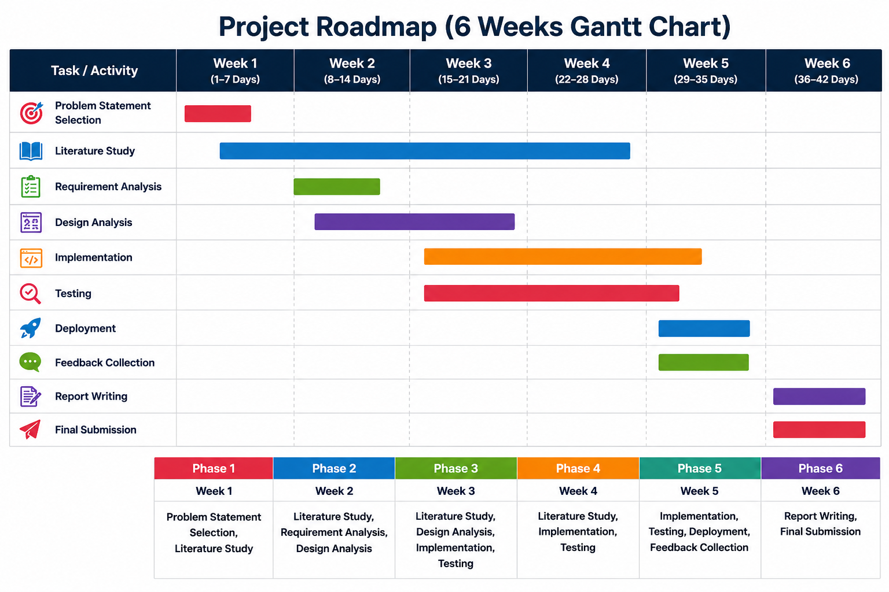

# Chapter 5: Product Development

The product development stage translates design specifications into functional software components. This section details the system's developmental lifecycle roadmap, modular software architecture, algorithmic logic models, and classification execution protocols.

---

## 5.1 Development Life Cycle (Roadmap)

The software development process followed a structured Agile-like system life cycle, breaking down tasks into weekly sequential milestones over a 6-week timeline:



### Weekly Milestones:
*   **Week 1 (Days 1–7):** Topic Selection, Literature Study, and Problem Statement formulation.
*   **Week 2 (Days 8–14):** Requirement Analysis, Design Analysis, and initial framework mapping.
*   **Week 3 (Days 15–21):** Design Analysis completion and commencement of system implementation.
*   **Week 4 (Days 22–28):** Complete core system implementation and conduct Unit/Integration testing.
*   **Week 5 (Days 29–35):** System cloud deployment, user feedback collection, and minor UI revisions.
*   **Week 6 (Days 36–42):** Academic report compiling, slide preparations, and final project submission.

---

## 5.2 Core Software Modules

The application is structured into six core, modular software subsystems:

1. **Questionnaire (Tabular) Prediction Module:** Processes user survey responses, translates clinical metrics into numerical matrices, and inputs them into the CatBoost Regressor to predict primary diagnostic conditions.
2. **Audio Feature Extraction Module:** Employs `librosa` and `parselmouth` to extract critical vocal acoustic feature vectors (pitch, jitter, shimmer, HNR, speech rate) from the recorded voice file.
3. **Audio Prediction Module:** Normalizes vocal vectors and runs the trained CatBoost Classifier to identify audio-based disorder predictions and confidence scores.
4. **Fusion Engine:** Integrates prediction scores from both the questionnaire regressor and audio classifier, applying weighted metrics to synthesize a final clinical screening diagnosis.
5. **Report Generation Module:** Compiles patient results, risk indices, and acoustic feature charts into a customized clinical PDF report using ReportLab.
6. **Assessment History Module:** Saves and retrieves historical patient assessments from the database, allowing users to track progress and trends over time.

---

## 5.3 System Algorithms

### Algorithm 1: Data Preprocessing and Model Training
**Input:** Tabular Dataset (`Tabular.csv`), Audio Feature Dataset (`AudioFeature.csv`)  
**Output:** Trained Tabular Models (`Disorder.pkl`), Trained Audio Model (`Audio_Model.pkl`), Scaler (`Scaler.pkl`), Label Encoder (`Encoder.pkl`)

```
1.  START
2.  Load the questionnaire tabular dataset (Tabular.csv) into a Pandas DataFrame.
3.  Impute missing data values and clean structural anomalies.
4.  Apply LabelEncoder to convert categorical survey features into numerical matrices.
5.  Separate the feature variables (X_tab) from the multi-disorder target variables (y_tab).
6.  Normalize numerical attributes using MinMaxScaler where required.
7.  Split the tabular dataset into an 80:20 Train-Test ratio.
8.  FOR each target mental health disorder:
        Train a CatBoostRegressor on the training subset.
        Compute R2 and Mean Absolute Error (MAE) on the test subset.
        Save the trained model pipeline as a serialized .pkl file.
    END FOR
9.  Save the questionnaire label encoders and preprocessing configurations.
10. Load the acoustic audio feature dataset (AudioFeature.csv).
11. Separate the acoustic feature vectors (X_aud) from the clinical target labels (y_aud).
12. Normalize the numerical acoustic feature vectors using StandardScaler:
        X_scaled = (X - Mean) / Standard_Deviation
    Save the scaler object as Scaler.pkl.
13. Encode the target categorical disorder labels using LabelEncoder and save as Encoder.pkl.
14. Split the audio dataset into an 80:20 Train-Test ratio.
15. Train a CatBoostClassifier on the scaled training features.
16. Save the trained audio classifier model as a serialized .pkl file.
17. END
```

---

### Algorithm 2: User Assessment and Multimodal Prediction
**Input:** Questionnaire Responses, Audio Recording (`.wav`)  
**Output:** Final Diagnosis, Graphical PDF Assessment Report, Database Historical Log

```
1.  START
2.  Collect questionnaire answers (PHQ-9, GAD-7, Loneliness, and Family features) from the Next.js UI.
3.  Serialize responses and save temporarily as questionnaire.csv.
4.  Preprocess questionnaire data using the saved LabelEncoder.
5.  Load the trained CatBoostRegressor models (.pkl files) for each disorder.
6.  Predict disorder probability scores and identify the top three highest-risk conditions.
7.  Generate clinical risk flags (e.g., Suicide Risk, High Psychological Distress).
8.  Accept the user's recorded vocal reflection (.wav audio file).
9.  Read the audio signal using Librosa and Parselmouth.
10. Extract acoustic features:
        - Pitch (Fundamental Frequency, F0)
        - Pitch Variability (Standard Deviation of F0)
        - Speech Rate (Words Per Minute)
        - Pause Duration (s)
        - Voice Energy (RMS Amplitude)
        - Jitter (Frequency Instability, %)
        - Shimmer (Amplitude Instability, %)
        - Harmonic-to-Noise Ratio (HNR, dB)
11. Save extracted features to audio_features.csv and normalize using Scaler.pkl.
12. Load the trained CatBoostClassifier model.
13. Predict the audio-based disorder classification and its corresponding confidence score.
14. Run the Fusion Engine:
        Final_Score = (Weight_Tabular * Tabular_Probability) + (Weight_Audio * Audio_Confidence)
15. Synthesize the final diagnosis and determine appropriate clinical recommendations.
16. Pass predictions to the report engine to plot Matplotlib graphs.
17. Compile graphs, tables, and XAI outputs into a PDF report via ReportLab.
18. Save all features, scores, and the PDF filepath to PostgreSQL via Prisma.
19. Purge temporary files (questionnaire.csv, audio.wav) from the server.
20. END
```

---

### Algorithm 3: Admin Management Module
**Input:** Admin Credentials, User Assessment Records, Retraining Datasets  
**Output:** Authenticated Session, Retrained Models, Updated Database Logs

```
1.  START
2.  Collect administrator credentials from the secure login interface.
3.  Authenticate the credentials against the hashed database records.
4.  IF authentication is successful:
        Display the administrator dashboard panel.
    ELSE:
        Return authentication error and reject login.
    END IF
5.  Allow admin to view user registration tables and historical assessment counts.
6.  Display system analytics (average score distributions, latency statistics).
7.  IF admin selects a record for deletion:
        Execute delete query via Prisma to purge the record from the database.
    END IF
8.  IF retrain request is triggered:
        Fetch newly aggregated clinical records from the database.
        Append new records to Tabular.csv and AudioFeature.csv.
        Execute Algorithm 1 (Model Retraining).
        Overwrite active .pkl pipeline files with the newly trained models.
    END IF
9.  Log all administrative actions in the system audit history.
10. Terminate session on admin logout command.
11. END
```
