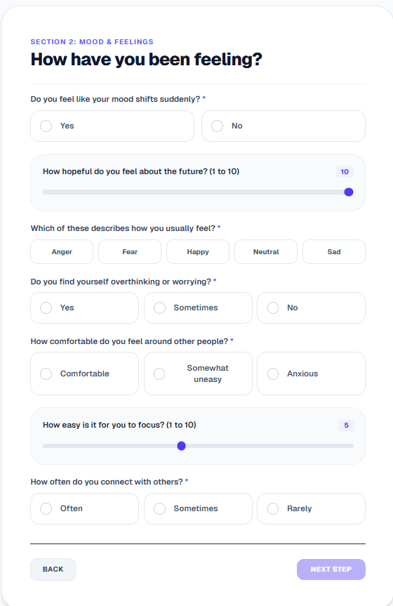

# Chapter 6: Implementation

The implementation phase establishes the deployment constraints, software environments, third-party libraries, and developer configurations of the MindTone system. This section provides an analytical breakdown of the runtime environments, utility packages, API integrations, and cloud hosting specifications.

---

## 6.1 Development & Run-time Environment

MindTone was implemented using a modern, multi-tier software stack:

### 1. Programming Languages & Runtime Engines
* **TypeScript (v5.0+):** Used across the Next.js application to enforce strict typing, preventing compile-time bugs in payload structures and database operations.
* **JavaScript (ECMAScript 2022):** Utilized for asynchronous browser operations and local utility scripting.
* **Python (v3.10+):** Selected as the computational core for the machine learning pipeline, signal processing modules, and reporting services.

### 2. Integrated Development Environment (IDE) & Utilities
* **Visual Studio Code (VS Code):** Used as the primary IDE, integrated with linting (ESLint, Flake8) and syntax formatting extensions (Prettier, Black).
* **Git & GitHub:** Used for continuous version control, modular branch management, and codebase repository sharing.
* **Webpack:** Configured as the Next.js development server compiler on Windows to ensure stable local development.

---

## 6.2 Key Software Libraries & Frameworks

### 6.2.1 Frontend Frameworks & Libraries
* **Next.js (React):** Serves as the core React framework. Utilizes server-side and client-side rendering for optimal load performance and secure cookies.
* **TailwindCSS:** Provides styling variables, enabling a clean, responsive layout across varying screen ratios (mobile, tablet, desktop).
* **Prisma Client:** A database toolkit that establishes connection pools and executes type-safe queries on our PostgreSQL tables.

### 6.2.2 Machine Learning & Data Science Libraries
* **CatBoost:** An advanced gradient boosting framework optimized for handling mixed numerical and categorical questionnaire features.
* **SHAP (SHapley Additive exPlanations):** An explainable AI toolkit that calculates cooperative game-theory shapley values to determine individual feature weights.
* **Scikit-learn:** Provides utilities for scaling data (StandardScaler, MinMaxScaler) and encoding labels (LabelEncoder).
* **Pandas & NumPy:** Used for loading, parsing, cleaning, and structuring clinical vector matrices.

### 6.2.3 Audio Signal Processing Libraries
* **Librosa:** An audio analysis library used to decode `.wav` files and extract raw acoustic features.
* **Parselmouth (Praat Wrapper):** A Python interface for Praat, allowing high-precision clinical voice feature extraction (specifically jitter and shimmer percentages).

### 6.2.4 Visualization & Document Compilers
* **Matplotlib:** A plotting library. MindTone configures it using a headless canvas (`matplotlib.use('Agg')`) to render pitch curves and prediction bar charts safely on headless web servers.
* **ReportLab:** A PDF generation engine used to draw tables, clinical summaries, and Matplotlib images into a structured clinical document.

---

## 6.3 System Deployment

* **Frontend Web App (Vercel):** The Next.js client is deployed to Vercel, leveraging their edge content delivery network (CDN) and serverless function environment.
* **FastAPI ML Service (Render):** Hosted on Render Web Services as a continuous Docker container, ensuring the Python/Librosa dependencies remain active and ready for async operations.
* **Serverless PostgreSQL (Neon.tech):** Hosts the primary database engine. Compute assets autoscale to handle spikes in check-ins and enter hibernation when idle to control costs.

---

## 6.4 Interface Screenshots

Below are the graphical user interfaces of the implemented MindTone clinical platform:

### 6.4.1 User Authentication Screen

### 6.4.2 Questionnaire Assessment Interface

### 6.4.3 Patient Dashboard

### 6.4.4 PDF Report Download Interface

### 6.4.5 Administrator Dashboard

