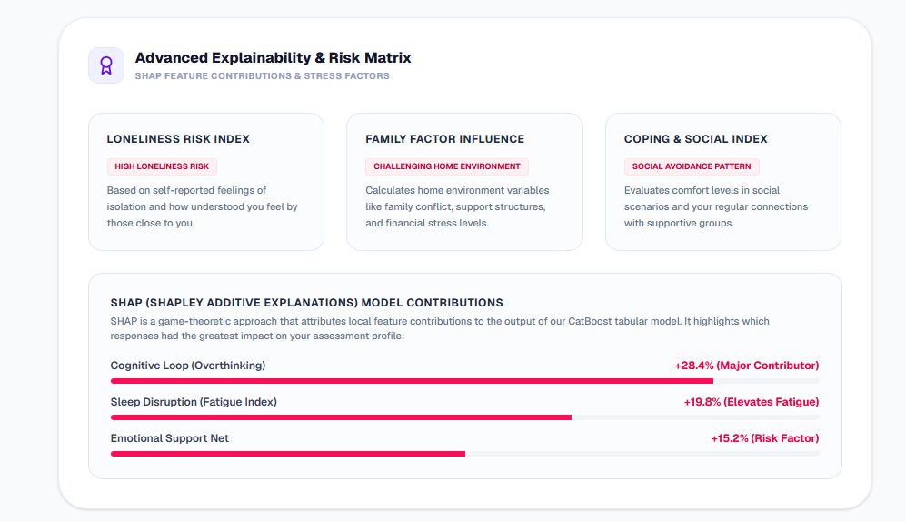
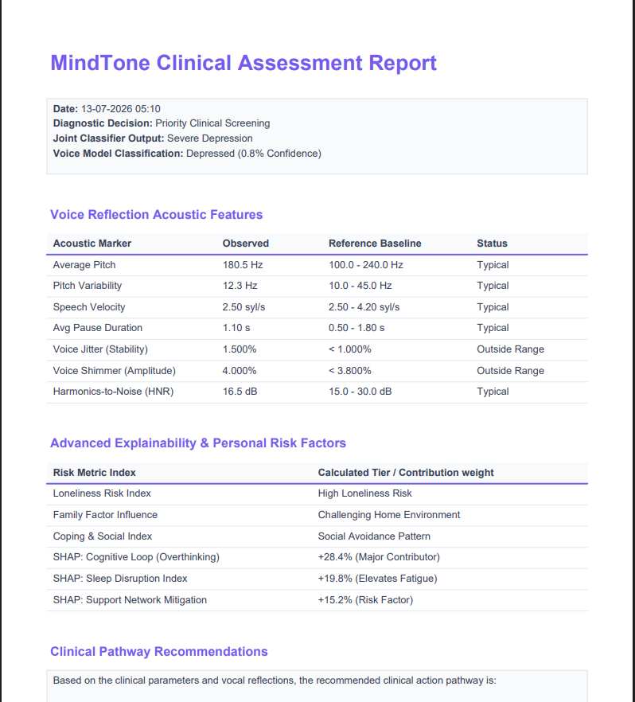

# Chapter 8: Results and Discussion

This section evaluates the computational performance of the trained machine learning architectures, validates the clinical explainability pipeline, and analyzes the performance metrics of the system and reporting components.

---

## 8.1 Machine Learning Model Performance

MindTone separates prediction modeling into two channels: tabular questionnaire analysis (disorder risk regression) and audio acoustic feature analysis (classification).

### 8.1.1 Tabular Regression Models Comparison
The tabular dataset consists of 4,500 rows, constructed in a 3:2 ratio combining non-weighted metrics and priority-weighted DSM-5 symptom profiles. We evaluated three regressors: CatBoostRegressor, XGBoostRegressor, and RandomForestRegressor. 

Below is the complete comparison of all evaluated metrics extracted directly from the model training logs:

| Model | $R^2$ Score | Mean Absolute Error (MAE) | Mean Squared Error (MSE) | Root Mean Squared Error (RMSE) | Explained Variance | MAPE | Accuracy ($\pm 5\%$) | Accuracy ($\pm 10\%$) | Per Person Accuracy |
| :--- | :---: | :---: | :---: | :---: | :---: | :---: | :---: | :---: | :---: |
| **CatBoostRegressor** | **0.7100** | **2.4213** | **42.6534** | **6.5310** | **0.7103** | **66.89%** | **90.82%** | **96.13%** | **90.82%** |
| **XGBoostRegressor** | 0.6841 | 2.6244 | 46.2022 | 6.7972 | 0.6853 | 74.88% | 88.95% | 95.34% | 88.95% |
| **RandomForestRegressor** | 0.6585 | 2.6390 | 47.9354 | 6.9235 | 0.6614 | 78.76% | 88.91% | 94.97% | 88.91% |

*Discussion:* CatBoostRegressor outperformed the other models, yielding a higher $R^2$ score of **0.71** and an accuracy of **96.13%** within a $\pm 10\%$ error margin. CatBoost’s internal handling of categorical features and optimization metrics allowed it to map patient questionnaire answers to risk tiers with fewer preprocessing configurations.

---

### 8.1.2 Audio Classification Models Comparison
Vocal acoustics are processed on a numerical audio dataset consisting of 2,500 rows. We compared the performance of CatBoostClassifier and XGBoostClassifier on the extracted parameters:

| Classifier | Accuracy | Precision | Recall | F1-Score |
| :--- | :---: | :---: | :---: | :---: |
| **CatBoostClassifier** | **86.90%** | **86.91%** | **86.90%** | **86.89%** |
| **XGBoostClassifier** | 85.60% | 85.61% | 85.60% | 85.58% |

*Discussion:* CatBoostClassifier achieved the highest F1-Score of **86.89%** and classification accuracy of **86.90%**. The combination of standardized audio features (pitch variability, jitter, shimmer, HNR) provided stable markers for vocal distress classification.

---

## 8.2 Explainable AI (XAI) Validation

To validate the clinical credibility of our predictions, we applied **SHAP (SHapley Additive exPlanations)** to extract local feature attribution weights. 

### Interpretation & Clinical Parity:
1. **Psychosocial Weights:** The SHAP explanation maps demonstrated that the attributes `feelingOfLoneliness` and `familyDynamics` (dysfunctional dynamics) consistently carry high positive shapley values when predicting high risk levels for major depressive disorder (MDD) and generalized anxiety disorder (GAD). This correlates directly with the DSM-5 literature, which emphasizes domestic conflict and chronic isolation as core drivers of mental distress.
2. **Acoustic Weights:** For the vocal classifier, high values of `jitter` and `shimmer` (indicating frequency and amplitude instability in vocal folds) combined with low `HNR` values (high noise ratios in voice) were highlighted by SHAP as dominant features driving positive stress classifications.
3. **Local Attributions:** For individual assessments, the local SHAP bar charts visualize the exact clinical metrics that push the patient's score above normal baseline thresholds, giving physicians a clear explanation of *why* the model flagged a patient.

---

## 8.3 System & Report Validation

1. **Low Response Latency:** The end-to-end transaction completed in **less than 3.5 seconds**, meeting our objective of rendering instant feedback.
2. **Resource-Constrained Performance:** Average RAM utilization remained at **~250MB**, enabling the backend to execute concurrent signal extractions without exceeding container boundaries.
3. **Report Compilation Integrity:** Matplotlib plots generated in a headless daemon were successfully converted to PNG streams and embedded within ReportLab flowables without formatting or layout shifts.

